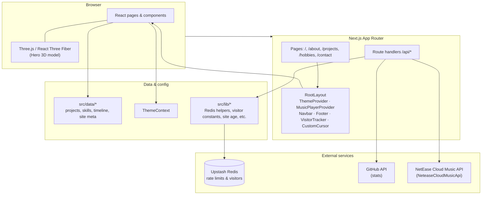
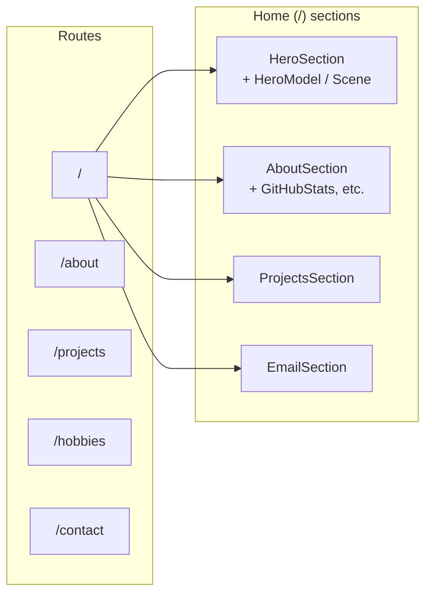
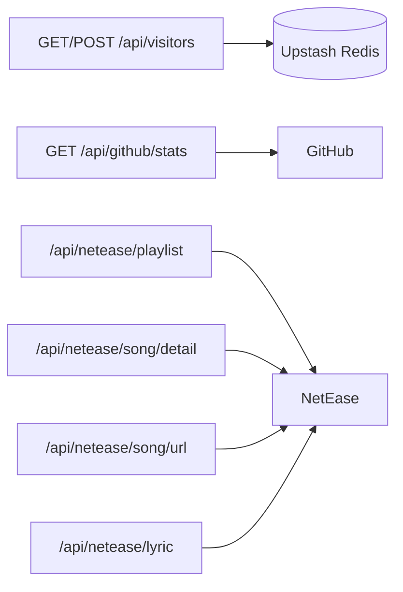
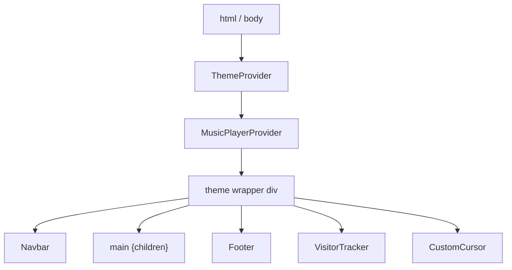

# Architecture

High-level diagrams for **portfolio-website-template** (Next.js 14 App Router). Mermaid blocks render on GitHub; for local editing, use a Mermaid-compatible preview or [mermaid.live](https://mermaid.live).

## System overview

Client UI, Next.js boundaries, data/config, and external services.

## Routes and home page composition

## API routes and dependencies

## Root layout shell

Global providers and chrome around `{children}`.

## Implementation notes

- **Dynamic imports:** The home page lazy-loads heavier sections (e.g. `ProjectsSection` with `ssr: false`, `AboutSection`, `EmailSection`) to reduce initial bundle work.
- **Theme & audio:** `ThemeProvider` and `MusicPlayerProvider` wrap the app so theme and player state survive client-side navigation.
- **Optional Redis:** Visitor APIs and rate limiting use Upstash when `UPSTASH_REDIS_REST_URL` and `UPSTASH_REDIS_REST_TOKEN` are set; otherwise routes degrade gracefully where implemented.

See [Template setup](TEMPLATE_SETUP.md) for environment variables and operational details.
