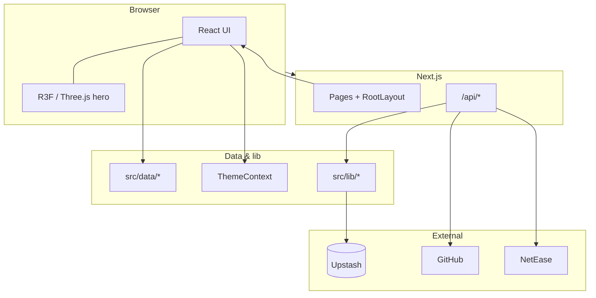
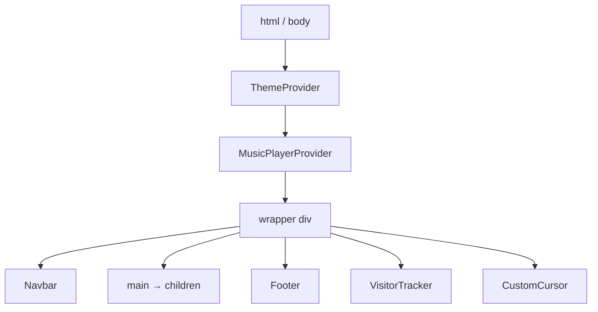

# Architecture

Next.js 14 App Router. [Mermaid on GitHub](https://docs.github.com/en/get-started/writing-on-github/working-with-advanced-formatting/creating-diagrams) may occasionally fail to load; **tables below** are the fallback.

## Routes

| Path | Notes |
|------|--------|
| `/` | Hero → About → Projects → Email (see `src/app/page.js`) |
| `/about` | About page |
| `/projects` | Projects listing |
| `/posts` | Blog index (Tina `content/post/`) |
| `/posts/…` | Blog post (catch-all; supports subfolders / Unicode paths) |
| `/admin` | Tina CMS (rewrites to `public/admin/index.html` after `tinacms build`) |
| `/hobbies` | Draggable windows |
| `/contact` | Contact page |

## API routes

| Route | Backend |
|-------|---------|
| `GET` / `POST` `/api/visitors` | Upstash Redis |
| `GET` `/api/github/stats` | GitHub |
| `/api/netease/playlist`, `/song/detail`, `/song/url`, `/lyric` | NetEase |

## Diagrams (Mermaid)

### System overview

### Root layout (`src/app/layout.js`)

## Notes

- Home lazy-loads heavy sections (`ProjectsSection` with `ssr: false`, etc.).
- Redis is optional; set `UPSTASH_REDIS_*` for visitors / limits. Details: [Template setup](TEMPLATE_SETUP.md).
